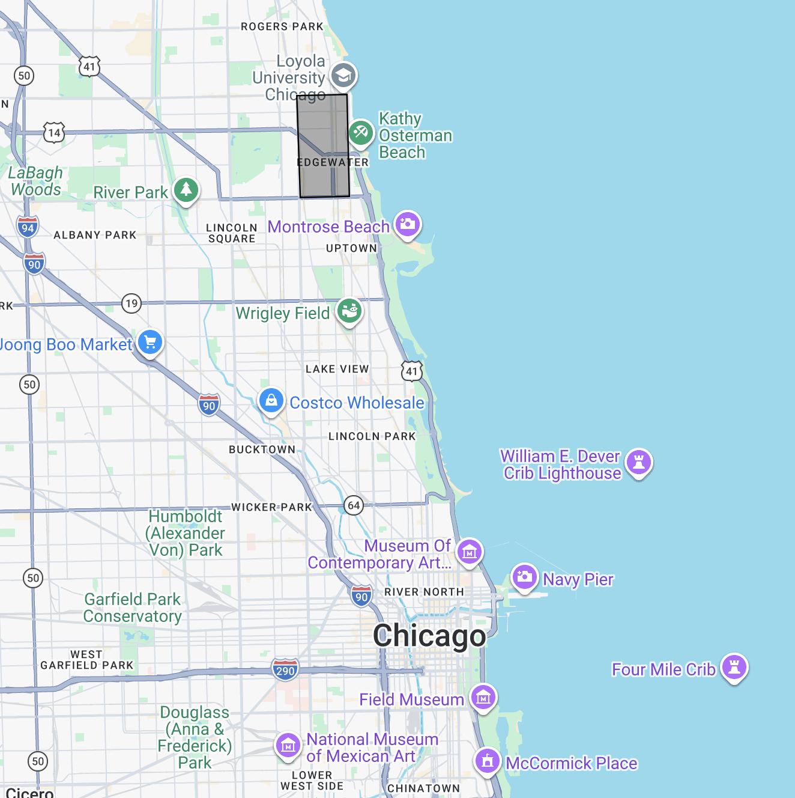
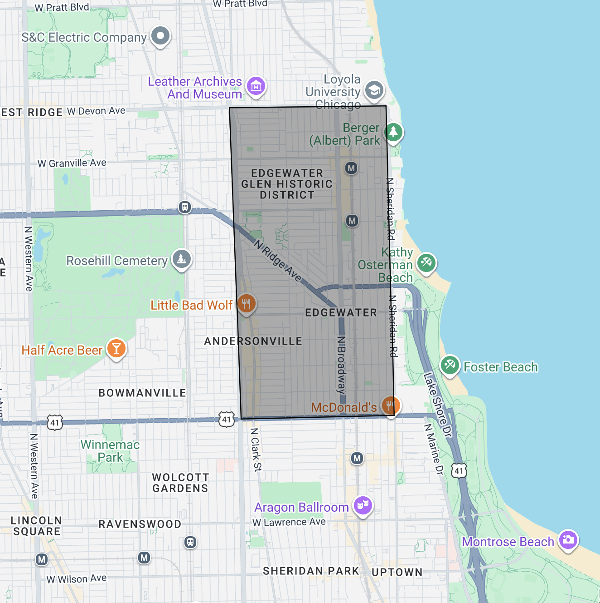
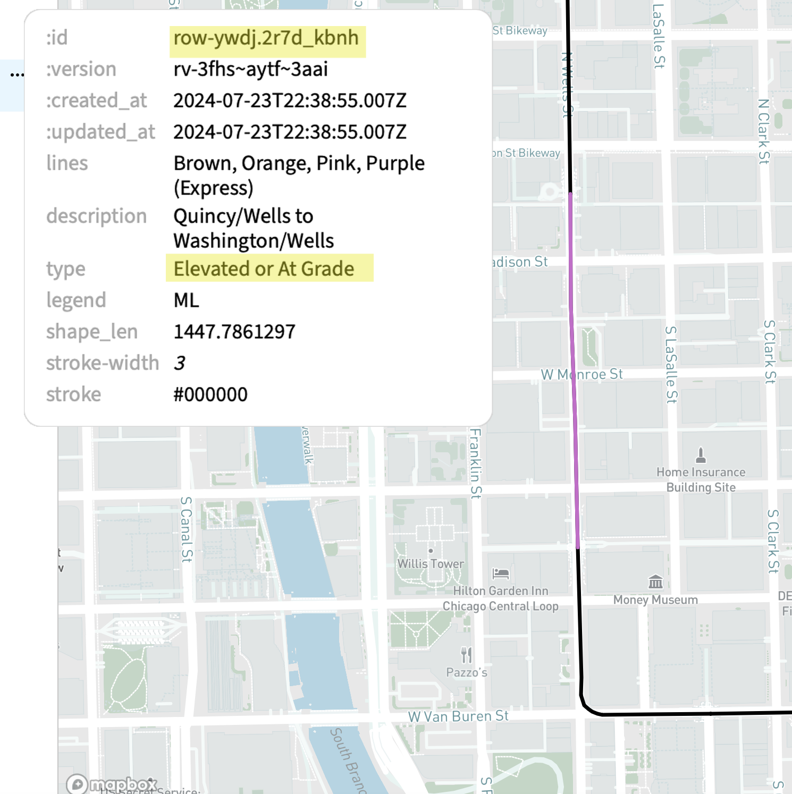
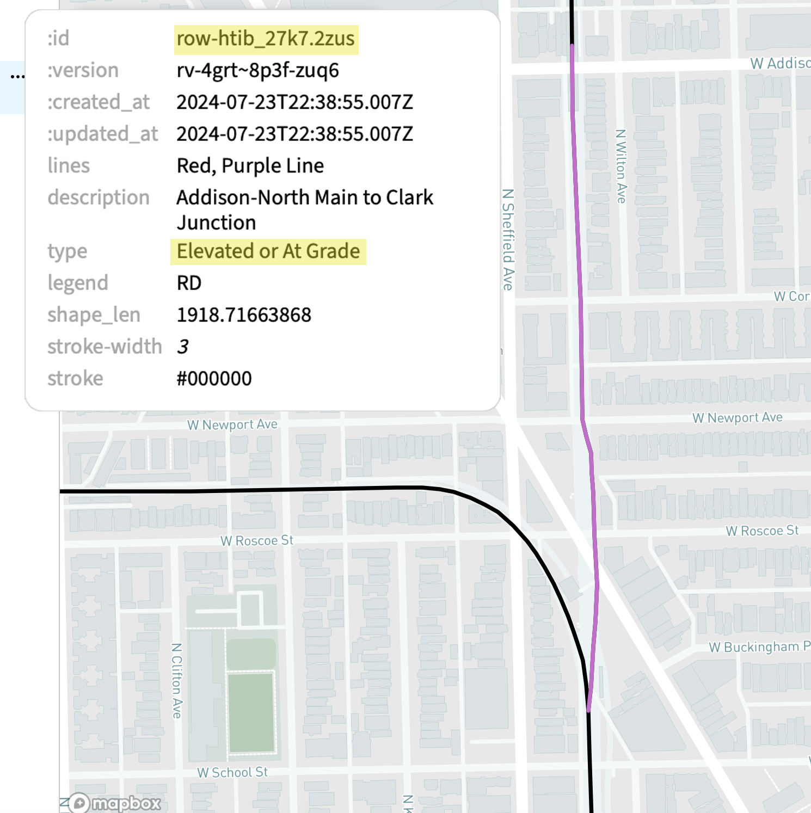
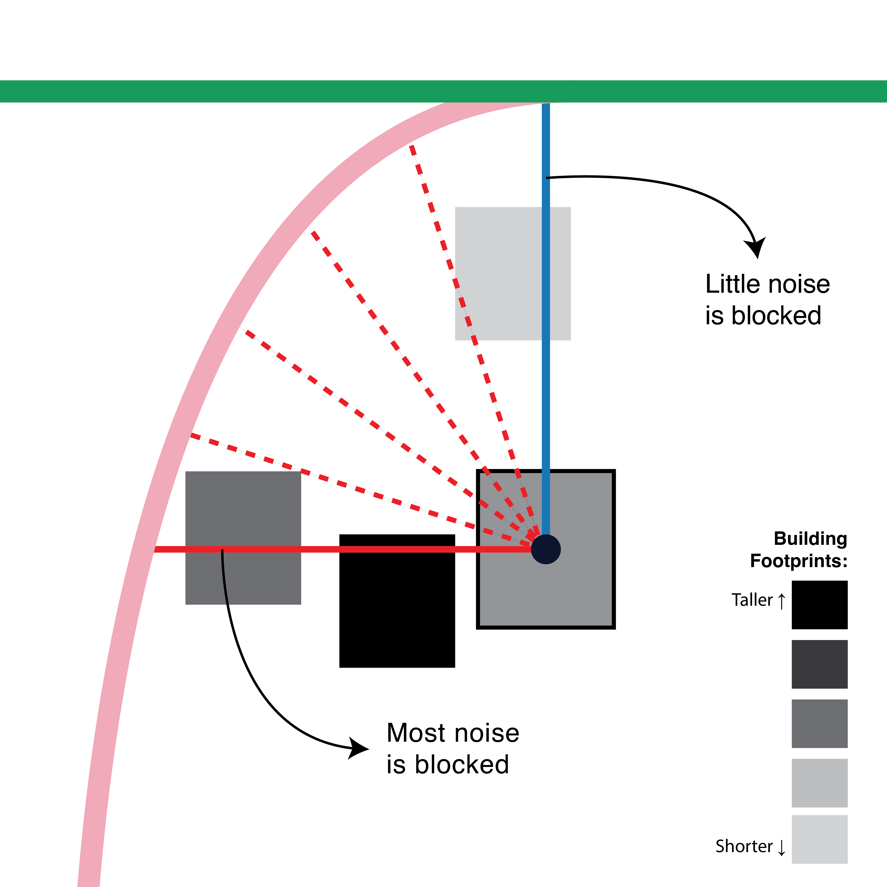

# Geospatial analysis of building footprints in Chicago

Based on this [building footprint data](https://data.cityofchicago.org/Buildings/Building-Footprints/syp8-uezg/about_data) and this [CTA line data](https://data.cityofchicago.org/Transportation/CTA-L-Rail-Lines/xbyr-jnvx/about_data) from the City of Chicago.

<hr>

### [2_bldg_intersections.ipynb](2_bldg_intersections.ipynb)

#### Creating a smaller df for testing my code
My box is centered around Edgewater and Andersonville on Chicago's north side. The Red Line runs through my box and I selected this area because of my personal familiarity with it.



#### Defining my Function
I want a function that will take the df row as an argument and then:
1. Find the centroid of the given building footprint
2. Find the nearest point on the CTA lines to that centroid
3. Draw a line btwn building centroid and nearest CTA point
4. Measure the distance of that line and **store it as a datapoint**
5. Identify all the building footprints that line intersects
6. **Record the total # of buildings intersected**
7. **Record the total heights of buildings intersected (# of stories)**
8. **Record the min and max heights of buildings intersected**

<hr>

### [3_merging_train_lines.ipynb](3_merging_train_lines.ipynb)

The current CTA line data I have is split into 152 LineString elements. I want my analysis to be robust enough to detect if a given property is close to two distinct train line (and the potential noise effects of that double exposure). With my CTA file, I will turn the small LineStrings into longer stretchs that share a common path and elevation status (Subway/Elevated or At Grade) with each longer stretch having a unique identifier. I also think it would be helpful to have a specific identifier for if the train segment runs in the median of a highway, because noise from those segments (particualrly the Blue line outside of the Loop) might not inherently have as much of an impact as the general highway noise.

I'm using [mapshaper](https://mapshaper.org) to help me interact with the geojson file in a simple interface to identify the ids of line segments I can combine
<div align="center">
     <br>
</div>

#### How I Organized the Lines

I used MapShaper to view each individual line segment and went segment-by-segment to determine what group it should be in (and how it made sense to group them). I ultimately decided to group train lines such that concurrent segments that form one straight line are in the same group, and any perpendicular or connecting lines would be in their own group. The below (rudimentary) illustration shows why:
<br>
<div align="center">

</div>
<br>
Suppose we are interested in calculating the noise experienced from train lines by the home with the black outline. The single shortest path between that building's centroid and any CTA line would extend to the Pink Line (as indicated by the solid red-colored line between the two elements). In this case, though, my current function would determine that our subject building experiences relatively low noise exposure because of the taller buildings in between it and the train tracks.

However, the building is also near the Green Line, and the shortest path to that line (indicated by the solid blue-colored line) would also find that more noise can reach our target building because there is only one, shorter building inbetween the two elements.

The path to the Green Line is not the second-shortest line, though, and it's not clear how many interceding lines would form a shorter path between the building and any CTA tracks (interceding lines indicated by the dashed red-colored lines).

Thus, my function will:
1. Find the shortest path and conduct any calculations with that line
2. **Record the group ID of that line path** (in this case something like "*pink-eag-curve"*)
3. Look for the next shortest path to **any line other than the one for which I've already reacorded a group ID**

I opened the [.csv version](data/cta_lines.csv) of the CTA lines in Sheets and created my line groups (16 in total). Below, I'm referencing that sheet and each element's unique ":id" to create my grouped line elements.

You can see my specific train groupings in the [my_cta_groups.csv](data/my_cta_groups.csv).

#### Dealing with "Subway" segments
Subways don't generate *zero* noise perceptable above ground, but it is significantly lower as compared to Elevated or At Grade train segments (just from my own personal experiences in Chicago). Because of this, I'll group all the subway segments onto one unified shape – essentially assuming the impact of being by one subway is not significantly different than being by two subways.

Also important to note: the only two trains that go below ground for parts of their runs are the Blue and Red lines, and those two lines are only close to each other for about a 6 block stretch, and that stretch is within the Loop, the place where every single train line is in close proximity. Because if this, too, I think it will be OK to not assume an addative effect of living near both the Blue and Red lines the same way someone would experience living near the separation of the Red and Brown lines on the north side.

<hr>

### [4_full_bldg_analysis.ipynb](4_full_bldg_analysis.ipynb)

#### My current function:
*Ran on entire dataset (800,000+ rows) in ~10:30:00*

```python
def train_noise(row):
    geom = row['geometry']
    id = row[':id']
    ## 1. find the centroid of the building footprint
    centroid = geom.centroid

    ##### go through each train line geom
    ##### find the distances to each one
    ##### find the shortest distance to a train line
    ##### do all my calculations around that one
    ##### find the next closest line
    ##### do all my calculations around that one
    
    ## 2. find the nearest point btwn CTA lines and centroid
    line = shortest_line(centroid, cta_line)
    ## 4. Measure the distance of that line and store it as a datapoint
    ## I believe EPSG 26971 has a base unit of 1 meter, so this length should already be in meters
    line_len = line.length
    ## 5. Identify all building footprints the line intersects
    intersected_buildings = full_map[full_map['geometry'].intersects(line)]

    ## had to add an if/else statement so my logic didn't break if there were no buildings intersected
    if len(intersected_buildings) > 0:
    ## 6. Record the total # of buildings intersected
    ## I do -1 at the end here because I think the .intersects() argument would count the building the line is connecting as a polygon it intersects with
        num_int_bldgs = len(intersected_buildings)-1
    
    ## 7. Record the total height of buildings intersected (# of stories)
        tot_height = sum(intersected_buildings['stories'])

    ## 8.1 Record the max height of buildings intersected
        max_height = max(intersected_buildings['stories'])
    else:
        num_int_bldgs = 0
        tot_height = 0
        max_height = 0

    return {'geometry': geom, 'centroid': centroid, 'dist_train': line_len, 'shortest_line_1': line,
            'num_intersections': num_int_bldgs, 'tot_stories': tot_height, 'max_height': max_height}
```