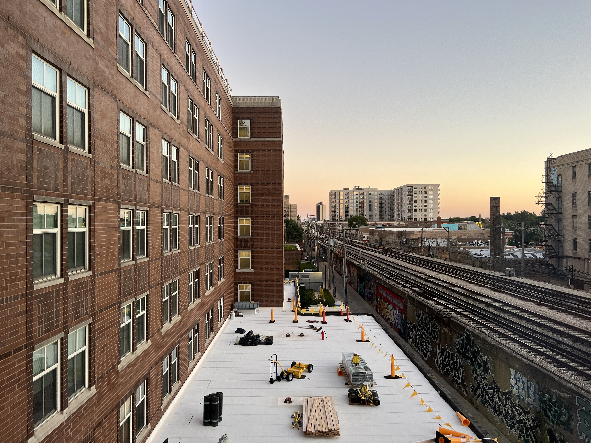
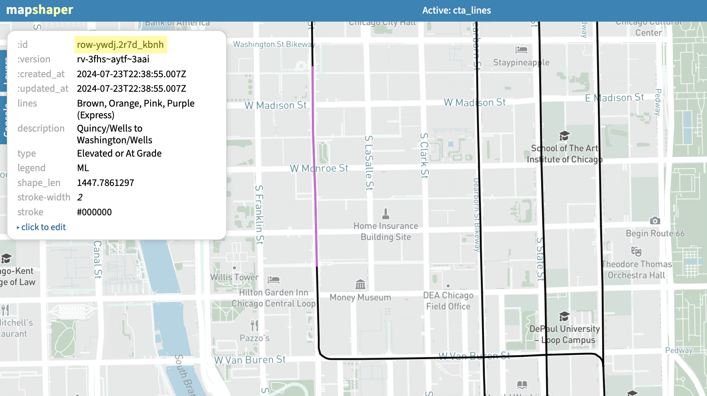
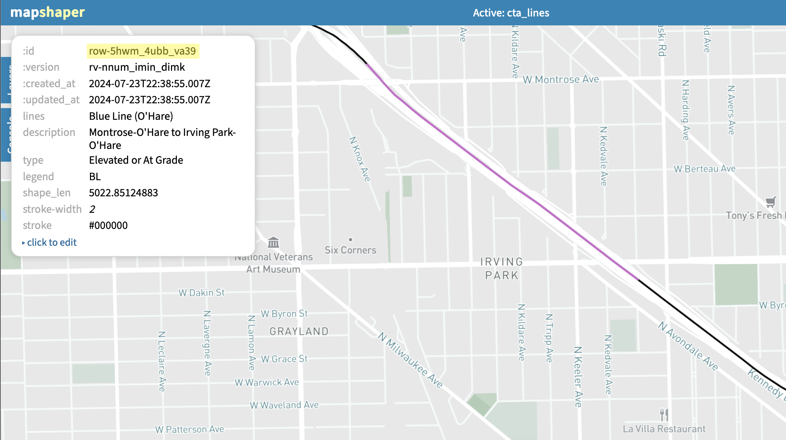
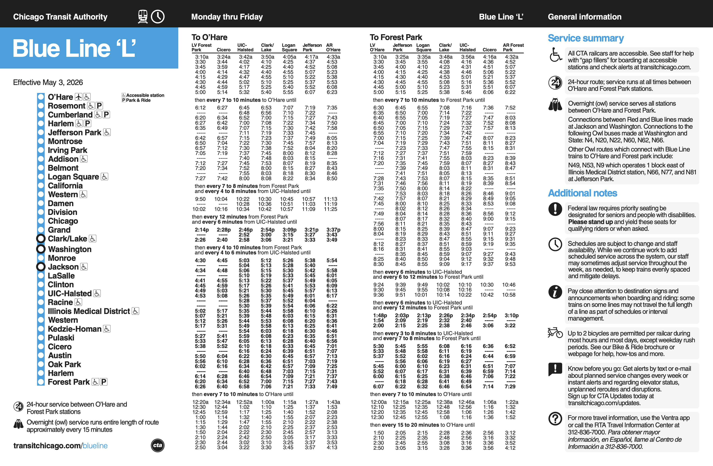
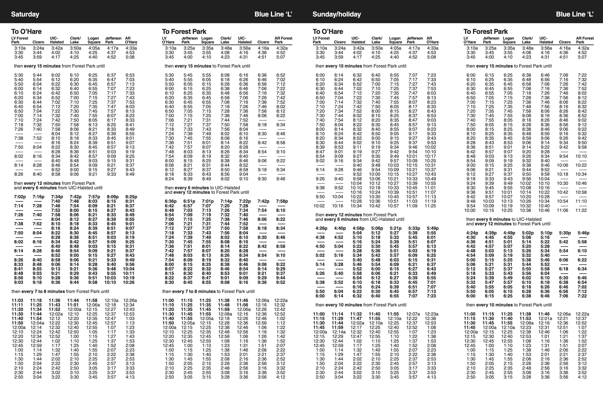
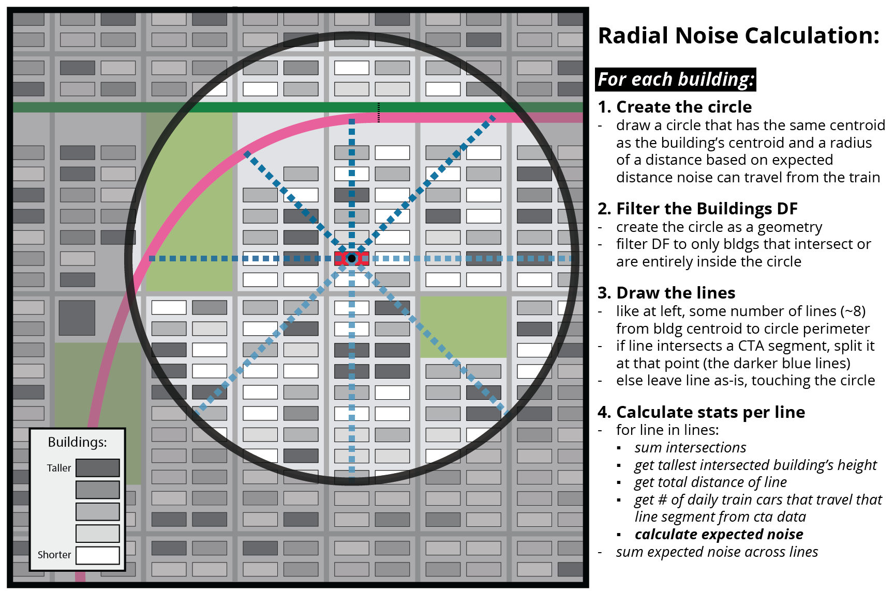

# Geospatial Analysis of Noise experienced by Buildings from the Chicago Transit Authority "El" Trains

> <br>
> The view from my sophomore year dorm room at Loyola University Chicago <br>
> <i>(A.K.A. my firsthand experience living right next to the 24/7 CTA Red Line)</i>

## Contents:
1. [The Project](#the-project) <br>
2. [The Data](#the-data) <br>
3. [Noise Measurements](#noise-measurements) <br>
4. [My Function](#my-function) <br>
5. [Results](#results) <br>
6. [Appendix](#appendix)


## The Project:
This repository is one piece of the data analysis for my Columbia Journalism School master's thesis.

In this project, I conduct a spatial analysis of buildings in Chicago to estiamte the noise each building experiences from nearby Chicago Transit Authority train lines. The project uses sound measurements I took around the city and the Shapely Python package to estimate each building's noise from trains, taking into account the average noise levels around the city.

The ultimate goal of this project is to create a reliable measure of expected noise per building to incorporate into a regression model along with housing price data and other factors that cause rental/home prices to fluctuate (neighborhood desireability/building amenities/proximity to city center/etc.) that will allow me to quantify the "train tax" or the optimal distance to live from the train to maximize accessibility while minimzing noise exposure.

<br>

## The Data:
My analysis largely relies on two data sets, both of them public and maintained by the city.

### [Building Footprints](https://data.cityofchicago.org/Buildings/Building-Footprints/syp8-uezg/about_data):
This data set contains information about every building in the city. Most importantly, it includes a geometry element for each building that shows the footprint of that building. This data is the foundation of my analysis and provides the specific locations and shapes of each of the building's I'm seeking to analyze.

The building footprints data came pretty clean from the city. The only change I made was removing NA geometries (6 rows) and translating the remaining geometries from WGS 84 projection to [NAD83/Illinois East](https://epsg.io/3435)*.

You can see my exploratory analysis of this dataset in [1_eda_w_data.ipynb](1_eda_w_data.ipynb).

**Note: I use the EPSG code 26971 to change the Coordinate Reference System, so one unit in my projection = one meter, not one survey foot*.


### [CTA Line Geometries](https://data.cityofchicago.org/Transportation/CTA-L-Rail-Lines/xbyr-jnvx/about_data):
This data set contains 153 line elements, each representing one section of the CTA system's track network. I use it here in conjungtion with the building footprint data to determine how far each building is from the CTA system and which routes it's closest to.

<div align="center">
     <br>
    <p><i>Two segments from the CTA geoJSON file in MapShaper</i></p>
</div>

I interacted with the data using [MapShaper](https://mapshaper.org), an online mapping tool that can parse and visualize geoJSON files. I used the unique `:id` field for each line segment (highlighted in yellow in the above images) to match each segment in a Google Sheet, which I then updated with each line segment's group name. Using this setup, I manually classified each line segment into a group based on two criteria:

### 1. Grouped line segments based on their track type:
For each line segment, I used satellite map imagery and street-view tools in order to determine which type of track section it was:
- "**subway**" if the tracks were underground for that stretch
- "**hwy**" if the tracks were in the median of a highway or immediately adjacent to a highway
- "**eag**" if the tracks were not "subway" or "hwy" types (commonly this looks like train tracks above roadways/alleys, and represents the majority of the CTA system)

I later decided to exclude fully underground track segments from my noise calculation. While trains running underground do not generate *some* noise that is perceptible on the surface, my own experiences in Chicago led me to conclude that this noise is negligible. This is partially due to the fact that trains run underground primarily in the noisier parts of Chicago; the Red and Blue lines, for example, run underground in the central business district (the Loop), where high-rise apartment/condo buildings and increased pedestrian and vehicle traffic mean both that residents are further elevated above subway entrances where noise could escape to the street, and that the subway noise that does escape is competing with higher ambient sound levels.

I chose to distinguish between non-subway lines that are or aren't adjacent to a highway for similar reasons: the ambient noise level near highways is higher due to the increased vehicle traffic. In addition to increased noise from other sources, some stretches of highway in Chicago have additional noise-reduction measures (they are constructed below-grade or with additional noise walls so as to minimize the sound affecting nearby commnities).

### 2. Grouped line segments based on which train lines travel that section
I used maps from the CTA and other transit-focused map views to classify each line segment based on which of the CTA's train routes run along that track section. For example, on the north side of Chicago, one 2-mile section of track carries traffic for the Brown, Purple and Red lines. Other sections (particularly those further from the city center) only carry traffic from one of the CTA's routes.

Later in my analysis I factor in the average number of trains that run on each segment daily, so that the aforementioned 2-mile stretch that is used by three different CTA routes is not generating the same expected noise values as a far less-busy stretch of track that only carries traffic for one route.

### Grouping Results:
Based and the above two criteria, I created 23 distinct track groups. They follow the naming format: **firstTwoLettersOfRouteColors_elevation_Notes_#**

>As an example, this is how I broke the Blue line into four segments. The Blue line **first** travels from the western suburbs into the city center along the highway, then **second** through the Loop on an underground track, **third** out from the city above ground through the near-northwest neighborhoods, and finally **fourth** to O'Hare airport along the highway again.
>
>**bl_hwy_south_12**: "bl_" indicates that the only line using this section is the Blue line. "hwy_" indicates that this particualr stretch runs in the median or a highway or else adjacent to a highway. "south_" is an additional note that indicates this is the southern portion of the Blue line (as opposed to bl_hwy_north_14, which runs from the northwestern neighborhoods to O'Hare airport). "12" simply indicates the order in which I created the track groups, but also creates an additional check in case my other naming criteria all resulted in two track sections having identical names. <br>
>**bl_subway_all_11**: As before, "bl_" indicates this track segment is only used by the Blue line. "subway_" shows this track section runs exclusively underground. "all_" here is used to indicate that all sections of the Blue line that run underground are included in this section. And this was the "11"th group I created. <br>
>**bl_eag_north_10**: This section is the only one of the Blue line's path that runs above ground and not adjacent to a highway. As such, I use the "eag_" category here. <br>
>**bl_hwy_north_9** Finally, this section mirrors the syntax of "bl_hwy_south_12", except that this section is the northern stretch of the Blue line that runs along the highway to O'Hare. <br>

See [Table 1](#table-1-cta-line-segment-groups-with-the-number-of-individual-segments-that-are-included-in-each-group-and-the-average-daiy-number-of-trains-that-run-on-that-section) in the appendix for each group's name, as well as the number of line segments that are included in each group.

### Calculating Average Daily Trains:
As mentioned before, I added another column to my grouped CTA line segment data. This additional column represents the average daily number of trains that run along each track section. This is an important variable to consider because some tracks have a relatively low number of trains that pass daily (like a stretch of the Green line that runs between the Ashland/63rd and Garfield and experiences 122 average daily train trips), and some line segments have significantly more daily traffic (like the northern/eastern sides of the central business district's Loop, which experiences over 1,000 daily train trips).

<div align="center">
     <br>
    <p><i>The front and back sides of the CTA's official Blue line time table brochure</i></p>
</div>

I used official [CTA timetables](/cta_schedule_brochures/) to calculate the number of train trips for each day of the week (most routes have a set schedule for weekday service, a different schedule for Saturday service, and another schedule for Sunday & Holiday service). I then used the occurrences of each of these different days in the calendar year 2025 (how many times holidays fall on Sundays vs other days, etc) and divided that by 365 to get the average daily number of trains.

[Table 2](#table-2-the-number-of-times-each-day-of-the-week-or-holiday-schedule-applied-to-the-cta-trains-in-2025) in the appendix shows the specific counts of each day in 2025. [Table 1](#table-1-cta-line-segment-groups-with-the-number-of-individual-segments-that-are-included-in-each-group-and-the-average-daiy-number-of-trains-that-run-on-that-section) shows the daily average number of train trips made on each of my section groups.

<br>

## Noise Measurements:
In order to accurately measure the specific impact of noise from the CTA trains, I needed to measure both the noise of CTA trains and the ambient noise levels around the city. After putting these measured values into formulas used for calculating noise levels at various distances, I could calculate how much louder than the ambient noise level a passing train would sound.

I recorded noise using the National Institute for Occupational Safety and Health's (NIOSH) Sound Level Meter (SLM) app.


<br>

## My Function:
The current iteration of this project is my second try at estimating noise for buildings. The code for my first attempt can be found in the [first_attempt_notebooks](/first_attempt_notebooks/) folder.

In this approach I draw up to 8 lines extending from each building's centroid to more accurately measure noise when it comes from multiple directions (eg. if a building is situated near the intersection of two perpendicular line segments). This illustration outlines the basic logic of my function:



As above, my Python function has multiple steps. Below, I break the function's code into chunks based on its purpose and outline the specific code that achieves this purpose.

### Defining variables
I conducted my own measurements of noise around Chicago to ensure it my analysis was based in real-world noise levels.

``` Python
noise_radius = 802 ## meters
radial_angles = [0, 45, 90, 135, 180, 225, 270, 315]

hwy_ambient = 76.15 ## dB
eag_ambient = 64.93 ## dB
train_avg = 93.97 ## dB
```

<div align-content="left">

$ \frac{1}{r} \cdot 10^{\frac{\text{dB}}{10}} = 10^{\frac{\text{expected dB at distance}}{10}} $


$ \frac{1}{r} \cdot 10^{\frac{\text{dB}}{10}} = 10^{\frac{\text{dB}_{\text{expected}}}{10}} $

</div>


My first function only created a single line between each building's centroid and the nearest point on any CTA line. For reasons explained [a few sections down](#3_merging_train_linesipynb), it's important to calculate noise levels for multiple lines to allow for cases where a building is situated near a corner created by two lines intersecting or overlapping.

The below diagram and accompanying text outlines how the function I'm currently working on will solve this problem by drawing a radius based on the distance it takes noise from the train to quiet to the average city noise level and calculating noise for several lines between the building centroid and the edge of the circle.


## Appendix:

### Table 1: CTA line segment groups with the number of individual segments that are included in each group and the average daily number of trains that run on that section

| Group Name | # of Line Segments | Avg. Daily Trains |
| --- | --- | --- |
| pu_eag_north_1 | 8 | 305.630137 |
| yl_eag_all_2 | 2 | 152.767123 |
| redpur_eag_north_3 | 13 | 479.901370 |
| br_eag_north_4 | 11 | 320.013699 |
| bropurred_eag_north_5 | 6 | 799.915068 |
| bropur_eag_north_6 | 4 | 401.054795 |
| rd_subway_all_7 | 10 | 398.860274 |
| red_hwy_south_8 | 8 | 398.860274 |
| bl_hwy_north_9 | 9 | 389.901370 |
| bl_eag_north_10 | 5 | 389.901370 |
| bl_subway_all_11 | 8 | 389.901370 |
| bl_hwy_south_12 | 12 | 292.424658 |
| gr_eag_west_13 | 11 | 246.926027 |
| pi_eag_west_14 | 11 | 235.750685 |
| or_eag_mdw_15 | 6 | 264.131507 |
| or_hwy_mdw_16 | 1 | 264.131507 |
| gr_eag_ashland63_17 | 2 | 122.065753 |
| gr_eag_cottgro63_18 | 2 | 124.860274 |
| gr_eag_south_19 | 8 | 246.926027 |
| gror_eag_south_20 | 2 | 511.057534 |
| grpi_eag_west_21 | 4 | 483.312329 |
| brorpipu_eag_loopsouth_22 | 5 | 900.936986 |
| brgrorpipu_eag_loopnorth_23 | 5 | 1147.863014 |

### Table 2: The number of times each day of the week or holiday schedule applied to the CTA trains in 2025
| Day | # in 2025 |
| --- | --- |
| Saturday | 52 |
| Sunday | 52 |
| Monday | 50 |
| Tuesday | 52 |
| Wednesday | 52 |
| Thursday | 50 |
| Friday | 51 |
| Holiday | 6 |

### Table 3: Location, measurement focus, duration, and measured level for my **highway** ambient noise measurements
| Report # | Location | Duration (mm:ss) | dB Level (LAeq) |
| --- | --- | --- | --- |
| [1](/noise_reports/1_hwy_ambient_1.pdf) | 5865–5899 W Railroad Ave | 02:39 | 73.2 |
| [5](/noise_reports/5_hwy_ambient_3.pdf) | 5128 S. Wells St | 03:02 | 79.1 |
| | | **Average:** | **76.15** |

### Table 4: Location, measurement focus, duration, and measured level for my **elevated/at grade** ambient noise measurements
| Report # | Location | Duration (mm:ss) | dB Level (LAeq) |
| --- | --- | --- | --- |
| [4](/noise_reports/4_eag_ambient_2.pdf) | 5213 S. Avers Ave | 03:02 | 67.1 |
| [6](/noise_reports/6_eag_ambient_4.pdf) | E. 54th St & S. Prarie Ave | 03:53 | 64.9 |
| [7](/noise_reports/7_eag_ambient_5.pdf) | 77 E. Adams St | 03:00 | 69.9 |
| [12](/noise_reports/12_eag_ambient_6.pdf) | 6302 N. Winthrop Ave | 02:12 | 57.8 |
| | | **Average:** | **64.93** |

### Table 5: Location, distance from train, train route measured, duration, measured level, and calculated dB at 1-meter from train for each of my train noise measurements
| Report # | Location | Train Route | Distance from train (m) | Duration (mm:ss) | dB Level (LAeq) | Calculated dB @ 1 meter |
| --- | --- | --- | --- | --- | --- | --- |
| [2](/noise_reports/2_train_1_52_ft.pdf) | 2124 S 47th Ct | Pink | 15.85 | 00:11 | 82.6 | 94.60 |
| [3](/noise_reports/3_train_2_40_ft.pdf) | 2124 S 47th Ct | Pink | 12.19 | 00:09 | 79.5 | 90.36 |
| [8](/noise_reports/8_train_3_31_ft.pdf) | 200 W. Randolph St (2nd floor) | Brown | 9.45 | 00:11 | 89.6 | 99.35 |
| [9](/noise_reports/9_train_4_43_ft.pdf) | 200 W. Randolph St (2nd floor) | Purple | 13.11 | 00:17 | 77.7 | 88.88 |
| [10](/noise_reports/10_train_5_75_ft.pdf) | 1110 W. Sheridan Rd (2nd floor) | Purple | 22.86 | 00:07 | 84.9 | 98.49 |
| [11](/noise_reports/11_train_6_47_ft.pdf) | 1110 W. Sheridan Rd (2nd floor) | Red | 14.33 | 00:09 | 80.6 | 92.16 |
| | | | | | **Average:** | **93.97** |